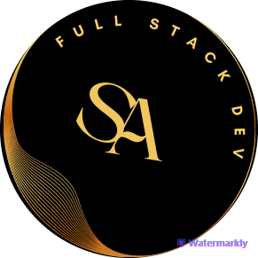
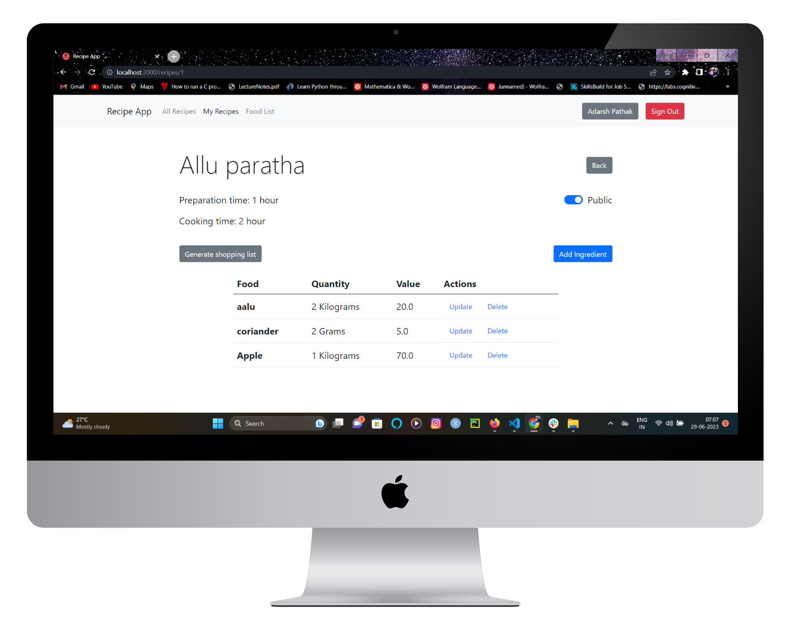
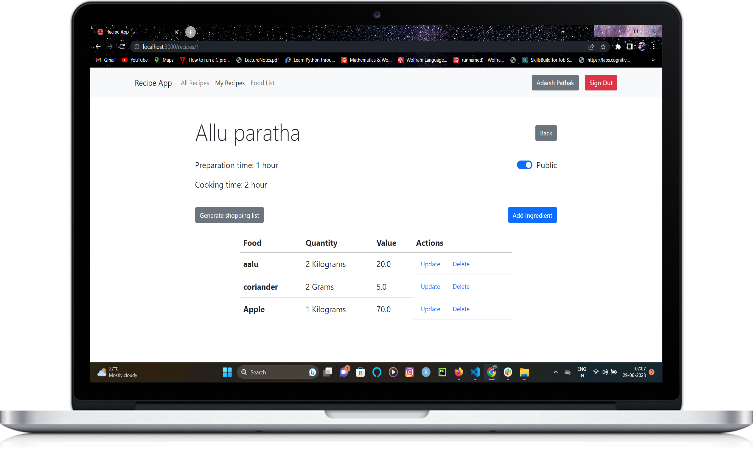

<a name="readme-top"></a>
<!-- TABLE OF CONTENTS -->
<div align = "center">
  
  
</div>

# 📗 Table of Contents

- [📖 About the Project](#about-project)
  - [🧪 Linters](#linters)
  - [🛠 Built With](#built-with)
    - [Tech Stack](#tech-stack)
    - [Key Features](#key-features)
- [💻 Getting Started](#getting-started)
  - [Setup](#setup)
  - [Prerequisites](#prerequisites)
  - [Install](#install)
  - [Usage](#usage)
  - [Run tests](#run-tests)
- [👥 Authors](#authors)
- [👁️ Presentation for Project](#video-presentation-for-our-project)
- [🔭 Future Features](#future-features)
- [🤝 Contributing](#contributing)
- [⭐️ Show your support](#support)
- [🙏 Acknowledgements](#acknowledgements)
- [📝 License](#license)

<!-- PROJECT DESCRIPTION -->

#  App mock

  
  


# 📖 Recipe App <a name="about-project"></a>

The Recipe app keeps track of all your recipes, ingredients. It will allow you to save ingredients, keep track of what you have, create recipes, and generate a shopping list based on what you have and what you are missing from a recipe. 

## 🧪 Linters And test <a name="linters"></a>
[](https://github.com/Stephen-Adom/recipe_app/actions/workflows/linters.yml)

## 🛠 Built With <a name="built-with"></a>

### Tech Stack <a name="tech-stack"></a>

In this project we utilize our skills and knowledge to create this project

<details>
  <summary>Project language </summary>
  <ul>
    <li><a href="https://www.ruby-lang.org/en/">Ruby</a></li>
  </ul>
</details>

<details>
  <summary>FrameWork</summary>
  <ul>
    <li><a href="">ROR</a></li>
  </ul>
</details>

<details>
  <summary>DataBase</summary>
  <ul>
    <li><a href="">Postgres</a></li>
  </ul>
</details>

<!-- Features -->

### Key Features <a name="key-features"></a>

- **log in**
- **Sign in**
- **Create A Recipe**
- **Add Food**
- **Generate Shopping list According to recipe added food**
- **Public And Private Recipe feature**

<p align="right">(<a href="#readme-top">back to top</a>)</p>


<!-- GETTING STARTED -->

## 💻 Getting Started <a name="getting-started"></a>

To get a local copy up and running, follow these steps.

### Prerequisites

In order to run this project you need:

- Ruby installed in your machine
- Ruby on Rails installed in your machine
- Postgres installed and all password and user being setup
- Any integrated terminal like
  - CMD
  - Bash
  - PowerShell
  - etc

### Setup

Clone this repository to your desired folder:

for cloning follow this steps
- go to green `code` button very top left corner of this Repository container
- copy your `SSH` or `https` file and clone it in your desired folder 
- or just download `ZIP` file
- [ ] Change UserName and Password with yours in [database.yml](./config/database.yml) file 

### Install

Install this project with:

for now you don't need any installation to run project if you already followed [Prerequisites](#prerequisites)

and 
```
bundle install
npm install
```

### Usage

To run the project, execute the following command:

you can use it for you library purpose 
run following commands in you `terminal` in root `dir` and if you open http://localhost:3000/ you can see App running 
```
rails s
```

### Run tests

To run tests, run the following command:


```
rspec spec
```

And for Linters

```
rubocop . //=> for ruby file linting 
npx stylelint "**/*.{css,scss}" //=> for CSS or SASS file linting 
```
`-A` and `--fix` flag for auto fixing respectively 


<p align="right">(<a href="#readme-top">back to top</a>)</p>

<!-- AUTHORS -->

## 👥 Authors <a name="authors"></a>

👤 **Stephen Adom Addae**

- GitHub: [@Stephen-Adom](https://github.com/Stephen-Adom)
- Twitter: [@stephen_alaska](https://twitter.com/stephen_alaska)
- LinkedIn: [stephen-addae](https://www.linkedin.com/in/stephen-addae/)
- GitUp Page: [Portfolio Page](https://stephen-adom.github.io/portfolio.github.io/)

👤 **Adarsh Pathak**

- GitHub: [@PowerLevel9000](https://github.com/PowerLevel9000)
- Twitter: [@PowerLevel9002](https://twitter.com/PowerLevel9002)
- LinkedIn: [Adarsh pathak](https://linkedin.com/in/PowerLevel)
- GitUp Page: [Portfolio Page](https://powerlevel9000.github.io/portfolio-project/)

<p align="right">(<a href="#readme-top">back to top</a>)</p>

<!-- FUTURE FEATURES -->

## 🔭 Future Features <a name="future-features"></a>

- [ ] **Styling of various webpage**
- [ ] **Dashboard for users**


<p align="right">(<a href="#readme-top">back to top</a>)</p>

<!-- CONTRIBUTING -->

## 🤝 Contributing <a name="contributing"></a>

Contributions, issues, and feature requests are welcome!

Feel free to check the [issues page](../../issues/).

<p align="right">(<a href="#readme-top">back to top</a>)</p>

<!-- SUPPORT -->

## ⭐️ Show your support <a name="support"></a>

If you like this project please give it star or buy a coffee for us

[](https://buymeacoffee.com/adi8090808E)

[](https://buymeacoffee.com/adi8090808E)

<p align="right">(<a href="#readme-top">back to top</a>)</p>

<!-- ACKNOWLEDGEMENTS -->

## 🙏 Acknowledgments <a name="acknowledgements"></a>


I would like to thank microverse for giving this opportunity to show up my skills

and the <a href="https://guides.rubyonrails.org/getting_started.html"> Ruby on rails docs </a>


<p align="right">(<a href="#readme-top">back to top</a>)</p>


<!-- LICENSE -->

## 📝 License <a name="license"></a>

This project is [MIT](./LICENSE) licensed.


<p align="right">(<a href="#readme-top">back to top</a>)</p>
